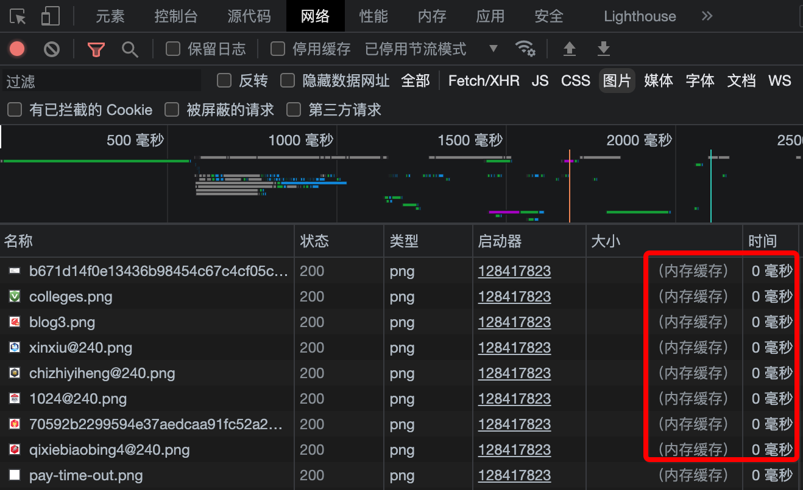
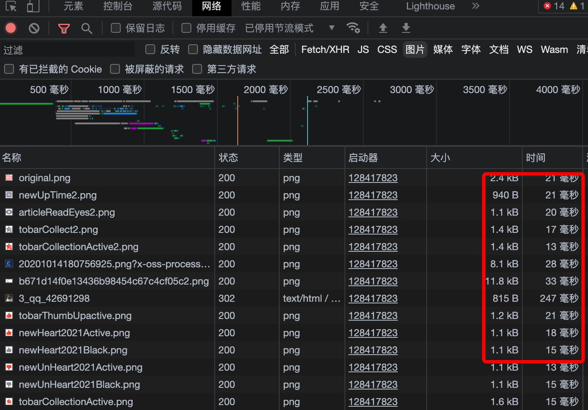

## 强制刷新

当网页加载异常时，我们自然会想到刷新，其实浏览器的刷新是“假刷新”，如果网页中有大量图片的话，刷新后会直观感受到第二次的刷新比第一次刚进来时图片加载要快很多，这显然不是网速突然变快的原因。真实情况是，浏览器会自动缓存当前的网页内容文件，当刷新时会复用这些缓存，也就是说用户无论怎么刷新，网页内容只会在最初被下载一次。通常情况下这是件收益很大的功能，对用户来说，提高了网页效率，对网站服务器来说，减少了文件传输、节省宽带流量。

但有些时候，因为网页文件无法更新，会带来一些问题，比如在网页出现加载异常，或网站已经更新，而自己还是刷不动最新的网站界面，这时候就必须用到强制刷新。

操作很简单，我们正常的刷新快捷键是：

- Windows和Linux操作系统：Ctrl+R
- Mac OS: Cmd+R

强制刷新只需在原有快捷键上加按Shift键即可：

- Windows和Linux操作系统：Ctrl+Shift+R
- Mac OS: Cmd+Shft+R

如何确认当前网页已经强制刷新了呢？虽然在直观感受上网页加载慢了一些，但感受是不准的，可以通过浏览器控制台查看，把控制台的面板切换到网络面板。

当没有强制刷新时，我们会看到网页中的图片来自内存缓存，加载时间是0毫秒，这也是网页很快的原因：

当使用了强制刷新后，浏览器会重新加载所有内容包括图片，这时候会看到网页中每一张图片的文件大小和加载耗时：

细心的读者会发现，网络面板标签底下有个【停用缓存】的选项，勾选后相当于禁用了浏览器缓存，连Shift键都不用按了，每次加载都是请求最新文件，当然了不足就是，无法享受浏览器缓存带来的加载速度。

