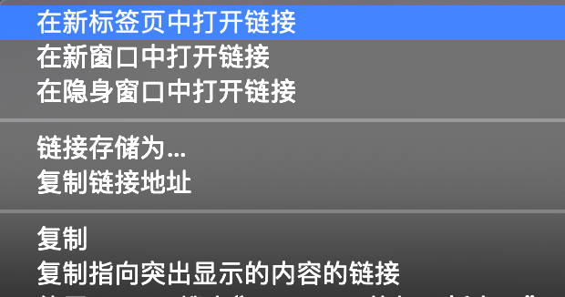

## 页面跳转
网页中的超链接点击后有两种打开方式：当前窗口打开和新窗口打开。很多时候当前网页被超链接更新后，需要点击后退或手动复制超链接再打开新窗口，这么繁杂的步骤其实可以一键解决：
在Windows系统下，按住Ctrl键的同时点击超链接，Mac电脑对应的是Command键，浏览器就总会在保留当前窗口，用新的标签页打开目标链接。

此外，如果想用新的独立浏览器窗口打开新链接，则按住Shift键即可。

上述Ctrl和Shift按键的能力，在超链接上，鼠标右键菜单里都能看到，他们分别对应【在新标签页中打开链接】和【在新窗口中打开链接】



右键菜单和快捷键都能实现同样的效果，因为快捷键的高效，这里首推使用快捷键。

菜单中有第三个选项【在隐身窗口中打开链接】，这也是一个有意思的功能，将在本书安全章节中讲解。


## 快速翻页

我们浏览的网页内容较多时，网页会用折叠的形式，把内容按固定条目折叠成多页，很多时候我们需要一页页的翻阅查找：


这里有个影响效率的问题在于，页面只会推荐当前页数周围的条目，如果我们清晰的知道自己的目标是第十页，不得不一步步点到第八或第九页才能出现第十页的按钮，这里推荐一个高效的技巧，但在此之前需要介绍一点网页超链接相关的知识。

在第一章有介绍计算机的一个核心概念：一切皆文件，我们所说的超链接实际上是一个URL（Uniform Resource Locator），中文叫统一资源定位符，自然也是一个文件，因此我们翻页的动作，可以理解为是翻阅一张张网页文件，每个文件在互联网中都有唯一的URL地址，在浏览器地址栏显示，比如：

```
https://pixabay.com/zh/images/search/tree/?manual_search=1&pagi=2
```

有黑客精神的浏览器用户，会发现每次翻页，URL的前面固定不变，只有后面的某个数字在随着页数的增加而增加，这个数字就是页码，发现这个后，我们直接更改地址栏中的数字后回车，即可跳转到指定的网页页码，免去了一步步累加翻页的步骤。

请记住这个技巧，后续还有相关技能需要同样的知识点。

## 黑客知识
如何连Ctrl都不按，让每一个网页都新窗口打开？
原理：blank
插件：推荐与开发