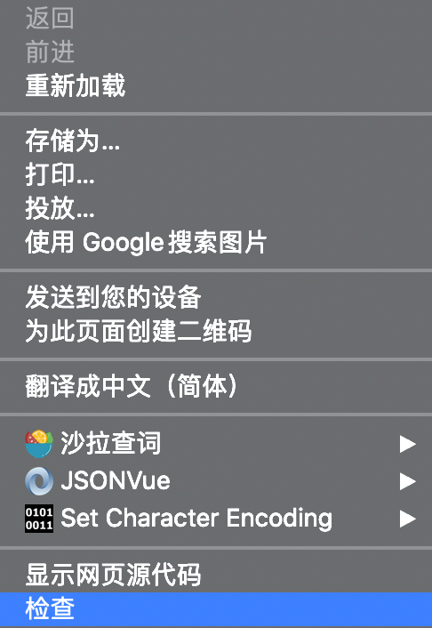
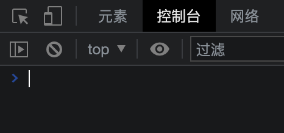

第一篇介绍的功能大多是浏览器自身提供的，本章节的内容则是浏览器没有提供的能力，需要我们基于浏览器的原理自己实现，这里重点依赖控制台。

如果把浏览器比作皮影戏，那控制台则帮助我们揭开幕布，走到背后操作网页，实现各种黑客技巧。

在Windows平台，按f12就可以打开控制台，苹果电脑下用command+option+i三个快捷键，还可以用鼠标右键菜单中的【检查】选项。

浏览器有个重要的概念是所见即所得，当我们看到网页，就意味着网页已经被下载到个人电脑里了，加上一切接文件，我们自然可以在本地对网页文件内容进行增删改查，下面我们通过一个例子来样式对网页的编辑。

控制台功能强大，主要使用人员是网站开发者，因为其交互友好，对非技术人员一样可以通过控制台实现黑客技能，我们只要用到以下三个面板：元素、控制台、网络。

