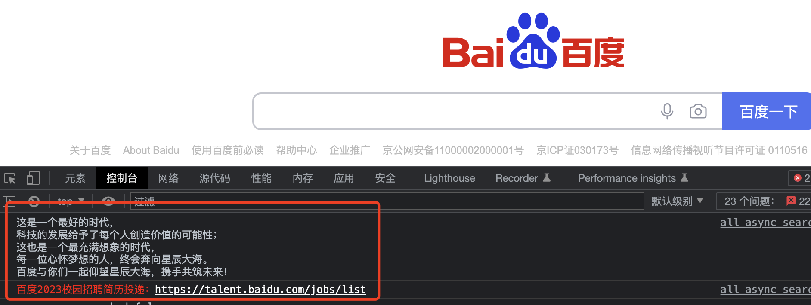
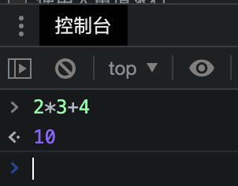

## 先从百度招聘广告谈起

## 计算器功能

在控制台的【控制台】面板，光标闪烁的位置，既可以编写JavaScript代码，也可以作为日常计算机使用。

日常生活中的整数加减乘除非常方便，与系统自带的计算器软件相比，最大的优势是能够清晰的记录运算过程，不至于在计算后者时，把前面的数字无法追述。

在计算中，每一次回车前即可提前预览计算出结果，回车后，计算步骤会保留，下一次计算可以拿新的结果继续下一步计算。

## 清空控制台历史记录
可以通过下面的方式清空控制台历史:

在控制台右键，或者按下 Ctrl 并单击鼠标，选择 Clear Console。
在脚本窗口输入 clear()执行。
在 JavaScript 脚本中调用 console.clear()。
使用快捷键 Cmd + K (Mac) Ctrl + L (Windows and Linux)。

## 截图
我们经常需要截图,Chrome DevTools 提供了 4 种截图方式,基本覆盖了我们的需求场景,快捷键 ctrl+shift+p ,打开 Command Menu,输入 screenshot,可以看到以下 4 个选项:

screenshot

## 滚动到视图区域 

右键 Scroll into view

## 工作区编辑文件 Edit Files With Workspaces
