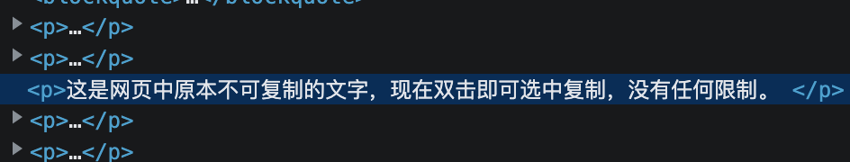
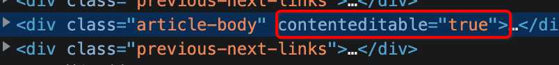

## 破除复制限制

很多网站的文本只能阅读不能复制，手动抄写打字的方式效率低下，容易出错，尤其是对于数字类文本或网站地址类文本，抄错一个字符意味着整体不可用，基于浏览器的所见即所得，本章将介绍多种网页文本的复制方式，满足不同的复制需求。

### 短文本复制

如果要复制的段落是一句话或一段号码，我们可以选中控制台左上角的第一个按钮使其成为高亮状态，然后鼠标点击网页界面上要复制的文本，再回到控制台，我们会发现在元素面板，已经自动定位到对应的网页标签代码片段，在标签中就有我们要复制的目标文字，双击文字，即可复制。



### 长文本复制

如果我们要复制的文本内容较多，按上述方式一次次的选中复制效率依然很低，为破除这个限制，我们需要先从浏览器的禁止复制原理说起。

我们在第一章中提到，网页内容是由HTML、CSS、JavaScript三种代码组成，其中JavaScript用于控制网页的行为，禁用复制的功能，就是JavaScript代码起到的作用，这三种文件在浏览器这个大容器中渲染执行，浏览器相当于代码的上帝，上帝赋予了JavaScript代码能力，自然也可以收回禁用这种能力，在网页打开后，我们用浏览器直接急用JavaScript代码，即可废除对复制功能的限制，可以向普通网页一样自由复制文本。

在控制台面板的后面，有个【设置】按钮，选中后进入【偏好设置】菜单栏，在偏好设置内容中找到【调试程序】，其中有个子选项【停用 JavaScript】，勾选后就可停用网页中JavaScript代码能力，再回到网页，选中要复制的网页段落就能正常复制。

禁用JavaScript很有杀伤力，如果网页中有JavaScript代码控制的动态效果，禁用后会发现这些效果也一并失效，网页成为一个纯静态的状态。

### 精确选择复制内容

在复制文本时，下意思的操作是拖动鼠标选中文本，在文本较长，有断行的时候需要保持框选的准确度，比较费事且效率低下，这里推荐几个快速选择的方法，增加工作效率。

#### 选择词组

直接鼠标双击，浏览器会根据中文分词选中目标词组，如果中文之间加载手机号或英文，鼠标双击也能直接选择整个手机号码。

浏览器集成了中文分词功能，对两个的词组或四个字的成语，无论在哪个汉字上双击，浏览器都能自动识别出完整的词组，比如：电脑，浏览器，全神贯注，发展中国家，发展中国的专家，文本夹杂12345数字。


选择段落：鼠标三连击。

选择超出屏幕，需要额外滚动的段落时，我们用鼠标选中后拖到屏幕底部，浏览器会辅助我们自动向下滚动，可滚动速度不收我们控制，很慢精确把控滚动暂停的位置，有一个最为便捷的方式，可以不用框选滚动，直接在复制目标范围的起点点击一下鼠标，再按住Shift键，在文本末尾点击再点击一下，就能选中首尾两次点击位置之间的所有内容，无论中间隔了多远的滚动距离，均可轻松选中。

## 终极复制：一边编辑，一边复制

有些时候我们选择的区域并非全部符合我们的需求，中间总是夹杂一些无关的文本或图片，下面介绍一种最为强大的复制方式，可以允许我们对网页内容任意修改，直到符合需求后再一键复制。

案例网页：https://www.runoob.com/jsref/met-win-getselection.html

打开控制台，选中标签选择器，在网页中选择要编辑和复制的区域，当元素面板定位到相应的代码后，在最外层的标签上右键，在菜单中选择增加属性


在新增的属性内容上，添加如下代码：

```
contenteditable="true"
```


修改后的标签代码如下所示：



这时候再回到网页中，点击刚才选择的区域，会发现选择区域有光标闪烁，网页内容像富文本编辑器一样，可以任意编辑，可以删除无用的图片或文字，也可以追加修改成自己想要的文本。

编辑完成后，直接快捷键Ctrl+A全部选择整个区域，然后Ctrl+C轻松复制编辑后的区域。


## 文字识别OCR

## 破解右键
