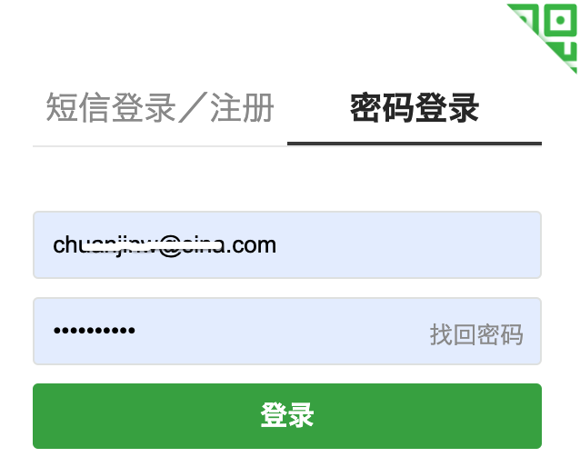
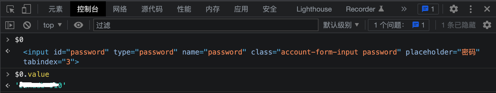

## 查看密码

很多网站会帮我们记录已登录的账号密码，便于登录，而时间长了会导致一个问题：因长时间未曾手动输入而忘记密码，此时的密码文本框是用黑点隐藏了密码明文，没有手动输入时候的显示明文勾选项，除了黑点的长度对应密码长度这一个信息外，我们很难想起密码原文，这里提供一个技巧，在控制台轻松查看被隐藏的密码。



打开控制台，选中标签选择器，回到网页，选择密码的文本框，在控制台的元素面板会定位到文本框的网页HTML标签代码，作为密码的文本框均是`<input>`为标签，属性`type=password`：

```
<input id="password" type="password" name="password" placeholder="密码">
```

选中后，把控制台面板切换到Console，在底部光标闪烁的位置，输入一下代码：

```
$0.value
```

回车，即可看到被隐藏的密码已经输出在代码底部：



## 原理讲解

上述代码中的$0，代表第一次选中的代码，如果我们用标签选择器还选择了其他标签，那就是$1，最多到$4，Chrome浏览器会帮我们记录5次历史操作中选择的标签代码，当仅输入$0时，返回的就是上述<input>标签，$0.value自然是读取标签里的值，即被黑点隐藏的明文密码。

注意这个技巧，这意味着你在他人电脑上的密码，一样也会被别人用这种方式查看到，在本书的安全篇会介绍防范措施。


