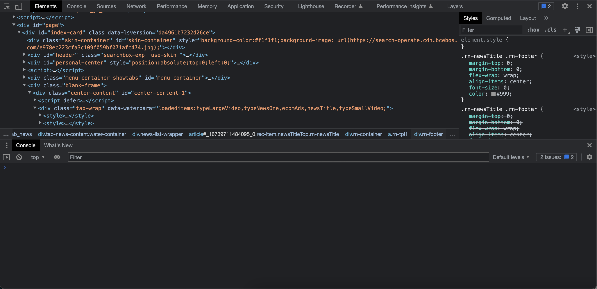
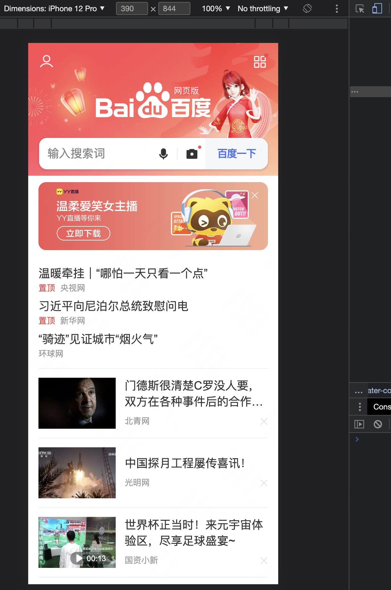
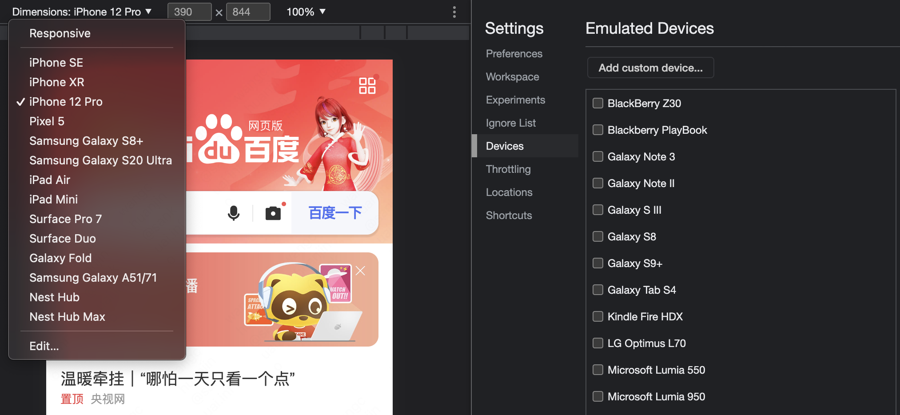

## 如何在浏览器上访问手机网页

在本书第一章中有介绍，浏览器除了上网以外，还有手机模拟器功能，现在就来演示浏览器作为手机模拟器的使用。

场景：有些网站只做了手机浏览器尺寸的适配，在电脑浏览器宽大的屏幕下字体过大，难以阅读。如果对这类网站的批量访问或截图等，在效率上，手机远低于电脑。如果有查阅手机网页的工作场景，需要一边看手机一般切换到电脑屏幕，如何避免手机网页和电脑网页来回切换的痛苦？

幸运的是，现代浏览器大多数都提供了移动仿真工具，Chrome浏览器就是最好的工具之一。它可以帮助我们在电脑上访问手机浏览器网页。

只需一步就可让浏览器切换为手机模式，我们需要再浏览器控制台中操作：

鼠标操作：鼠标右键，在右键菜单中选择【检查】，会看到浏览器多出一个面板：



浏览器控制台是本书的重点，在后续的诸多技巧中均有涉及。

在控制台左上角，有个手机符号的按钮，选中，即可切换到手机模式：


这时候访问网页就和在手机浏览器里访问一样，我们以百度为例：



演示中所使用 iPhone 12 的手机模拟器尺寸作为演示，还可以切换苹果或安卓的其他手机：



### 原理解析
网站是怎么识别用户使用的浏览器是手机浏览器还是电脑浏览器呢？答案是通过userAgent识别。
每一个浏览器都有userAgent，简称UA，是浏览器类型的标识，我们再用浏览器上网时，会在网络请求中带上UA信息，作为请求响应的服务器，根据UA信息可识别当前浏览器是否为手机浏览器，从而发送对应的网页类型，至于UA长什么样，我们可以通过浏览器控制台中的Console面板查看，选中Console面板，在下卖弄可以看到输入光标在闪动，在这个位置输入：

```
navigator.userAgent
```

即可看到当前浏览器的UA，笔者使用苹果电脑安装的Chrome浏览器，显示的UA信息为：
```
'Mozilla/5.0 (Macintosh; Intel Mac OS X 10_15_7) AppleWebKit/537.36 (KHTML, like Gecko) Chrome/109.0.0.0 Safari/537.36'
```

再切换到手机浏览器模式下，重复上述步骤，发现UA变了：

```
'Mozilla/5.0 (Linux; Android 6.0; Nexus 5 Build/MRA58N) AppleWebKit/537.36 (KHTML, like Gecko) Chrome/109.0.0.0 Mobile Safari/537.36'
```

可以看到UA信息中包含了Android 6.0、Nexus 5等手机浏览器信息。

细心的读者会发现，为什么UA这么长？后面还有与当前浏览器无关的信息，比如like Gecko、Safari等浏览器标识？

这就要从浏览器混战开始讲起了，由于蒂姆·伯纳斯·李开发的世界第一款式浏览器Nexus支持支文字，不支持图片，马克·安德森开发的第二款浏览器Mosaic才开始支持图片，对于当时的网站开发者来说，需要对支持图片的浏览器发送图片数据，就需要通过UA来判断当前浏览器是否是Mosaic，其对应的UA信息为：

```
NCSA_Mosaic/1.0 (Windows 3.1)
```

看，早起的浏览器UA信息还很简短，只包含两个信息：其中 NCSA_Mosaic/1.0 是浏览器名称代号及其版本号，Windows 3.1 是操作系统及其版本号。

随后马克·安德森创办网景公司，开发出新浏览器，其代号为Mozilla，对应的UA信息为：

```
Mozilla/4.5 (compatible; HTTrack 3.0x; Windows 98)
```

网景公司的浏览器Mozilla一度占据市场90%以上的份额，功能强大，有些新功能当时只有在Mozilla中支持，随后在网景与微软的浏览器大战中，网站开发者同样需要通过UA信息识别是否为Mozilla，从而给用户呈现最为丰富的网页能力。这对微软的IE浏览器带来一个新问题，即使IE为了追赶补齐的对应的功能，也为因为UA信息不是Mozilla而接收不到包含新能力的网页内容，虽然微软影响力很大，也不能强制要求所有网站开发者单独为了IE修改代码，怎么办？既然打不过那就加入，于是微软把自己的IE浏览器UA信息改成了Mozilla，只是在其他的角落位置额外追加了MSIE标识，代指自己同时也是Microsoft Internet Explorer。伪装后的IE浏览器UA信息为：

```
Mozilla/4.0 (compatible; MSIE 1.0; Windows 3.11)
```

就这样，UA信息的基本格式被固定下来，直至今日，所有浏览器UA信息都是以Mozilla开头，随后为了实现其他能力的兼容，UA信息也被各大浏览器厂商追加的越来越长，也就是当前的这样。

问题来了，既然通过修改UA就能伪装成不同浏览器，那手机浏览器能否伪装成电脑浏览器，从而在手机浏览器上访问和电脑浏览器一样的网页呢？答案当然可以。

在手机浏览器的设置里就可以切换UA，由于市面上手机型号和手机浏览器众多，读者可以根据自己的手机浏览器情况自行查找设置，下面以一款安卓手机浏览器设置界面为例：


把UA标识切换为电脑模式后，再打开百度首页，电脑上熟悉的百度首页就会出现在手机浏览器里。

上述讲到的更改浏览器UA均是通过浏览器自身提供更改选项，在计算机领域，黑客可以通过代码任意修改UA，从而实现更灵活的伪装。

## 手机滚动截图

在手机上操作网页滚动截图，效率相对比较麻烦，如果系统不支持，往往需要第三方软件或拼接，截取后的长图默认存在手机上，还需要文件转移，现在在模拟器上就可以快速完成截取长图:
在模拟器上方工具栏，点击：


完成后浏览器自动截图整个网页的长图，保存到电脑上。

另外，在工具栏上还有个旋转标识的按钮，选中后即可进入手机横屏模式，这里不在一一举例，浏览器的模拟器功能很强大，其他菜单能力读者可以进一步探索。

## 图片迅速转移到手机
工作中往往用电脑进行图片搜索，因手机屏幕尺寸的限制，搜图效率注定低于电脑，当找到心仪的图片后，如何快速传到手机上？

你可能想到的是用截图工具截图，或下载源文件到电脑，再用手机和电脑同时都登录的通信工具把截图文件传输到手机上，这个方式在操作步骤上比较繁琐，且截图的图片和没有原图的质量高，用Chrome浏览器的一键生成二维码即可快速实现这一步骤：
在图片上右键打开菜单，选择【为此图片创建二维码】，然后用手机扫码，这时候手机加载的就是电脑浏览器上的原图，没有任何中间传输环节的二次压缩。


