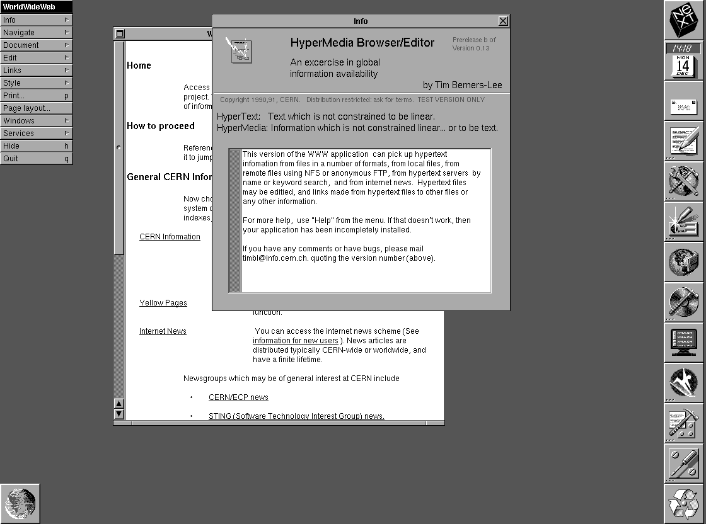

## 浏览器历史

想要了解现代浏览器，我们不得不从它的历史说起。

1989年，Tim Berners-Lee发明了万维网（World Wide Web），当时他在欧洲粒子物理实验室（CERN）工作，遇到了团队信息协同的问题：
随着团队人员的流动，原本口口相传的信息不断流失，有时虽然记录在案，关键时刻也难以查找，每当团队有新人加入，要花费相当多的时间进行信息同步。更糟糕的是，实验室的信息是不断更新的，不可能用一本固定的书籍或文档一次性写完，这使得团队疲于应付信息的查找和更替，信息丢失的问题较为严峻。

蒂姆·伯纳斯-李团队面临的问题在当时只是一个缩影，信息协同问题至今依然存在，只是现在的我们有了很多成熟的工具得以缓解，伟人的不同之处在于，遇到共性问题是想办法克服，而非躲避。

> “或许 10 年后，这些问题会有成熟很多商业解决方案，而今天我们就需要做些什么来解决它” —— 蒂姆·伯纳斯-李 在Information Management: A Proposal 中写到。

于是Tim Berners-Le设计了一种新的信息连接系统：系统内的文档用链接的方式自由指向下一条信息源，相互之间的引用指向没有限制，这样把实验室整体信息组成一个网状结构，当某个环节有信息更新，在链接的作用下得以共享，这使得整体信息能够与实验室时刻保持同步。

这就是万维网的原型。中文世界里，World Wide Web也被信达雅的翻译成万维网，真好可以简写为WWW。

1990年，在实现这一理念的过程中，浏览器作为访问网络节点内容的工具，得以开发出来，最初浏览器的名字叫WorldWideWeb，后来为避免名称与万维网（World Wide Web）混淆，重新命名问NEXUS，这是它的历史图片：

可见浏览器从诞生之初就作为解决问题的工具，被发明出来，第一版支持文字的浏览，连图片都不支持，而如今，随着计算机与网络的发展，网页演变为应用，浏览器也演变为网络入口的超集，凭借其丰富的能力，帮我处理音频、视频，为我们提供娱乐和办公，这些在本书后续章节中均有介绍，希望通过这些能力，让浏览器这个强大的工具，帮助你解决日常工作生活中更多问题。

【工具的发明是为了解决问题，】

## 浏览器混战

1993年，计算机科学家马克·安德森（Marc Andreessen）开发了一款支持图片的浏览器Mosaic（马赛克），自此浏览器开始流行。隔年，安德森创立Netscape（网景公司），向市场推出Netscape Navigator浏览器，获得巨大成功，这份成功注定会在市场上引发一场战争。

1995微软推出了Internet Explorer，也就是我们熟知的IE浏览器。Netscape 与 Microsoft 开始进入浏览器市场的争夺战，战争是推动技术进步的有效途径，在此期间，浏览器进化的更快更强，很多现在的浏览器技术标准在那时被设计出来。

随后IE浏览器捆绑在微软操作系统内，凭借着操作系统的占有率，这个杀手锏策略彻底赢得浏览器战争，让其市场份额一度上涨到 99%，随后微软面临美国反垄断法诉讼。Netscape也开源了代码，发布非盈利的Firefox浏览器。

中国国内的浏览器大战，来的要晚一些。

九十年代后期，IE打赢浏览器大战后，稳居全球市场份额第一，技术圈内出现基于IE浏览器定制化开发的小众浏览器，国内出现一款名叫MyIE的免费开源浏览器，后来毕业于北京理工大学，计算机专业的陈明杰接手此项目，到2004年，这款开源浏览器的全球用户数突破一百万，随后陈明杰重新命名为Maxthon，中文名叫遨游，到2009年，傲游已成为中国市场份额第二大的浏览器，仅次于微软IE浏览器。

2008年，360推出360安全浏览器，在杀毒软件领域，凭借360安全卫士永久免费的策略，独占鳌头，旗下浏览器，自然也迅速占领市场，随后超越遨游。

## 浏览器现状

当年稳居全球市场第一的IE浏览器在2022年6月宣布停用，目前市场份额最多的是后起之秀chrome浏览器。
固一世之雄也，而今安在哉？

根据流量监测机构Statcounter在2022年7月公布的数据，
Chrome：66.19% (-0.74%)
Edge：10.84% (+0.2%)
Safari：8.94% (+0.01%)
Firefox：8.08% (+0.28%)
Opera：3.06% (+0.08%)
IE：0.75% 

本书后续章节的示例以chrome浏览器作为演示，知识是可以迁移的，技巧虽在不同浏览器略有差异，但知识是相同的，原理性的知识在现代浏览器上一样适用。

参考文献：Information Management: A Proposal
《浪潮之巅》

补充：网景公司：https://zhuanlan.zhihu.com/p/27725017